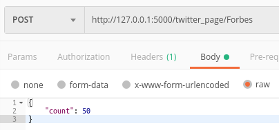
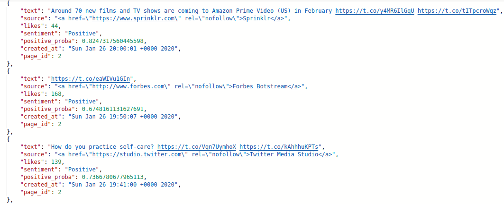
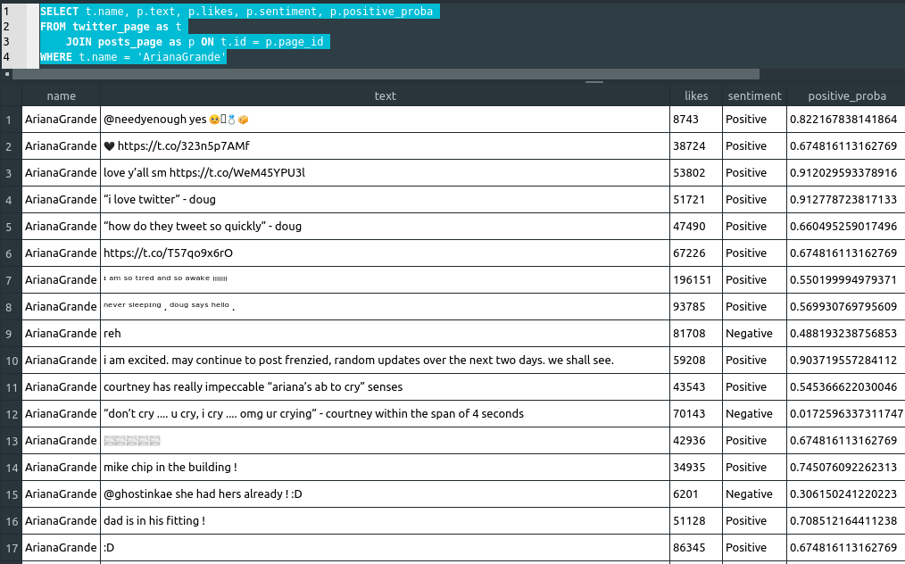

# PyTwitter-Crawler
This project is an extension to the ["twitter_sentiment_analysis"](https://github.com/Seriozha/tweets_sentiment_analysis).

This is a Flask REST-API written in python using Flask-Restful framework and SQLAlchemy,
it also incorporates the twitter's own API to mine tweets from public profiles. It then retrieves a given number of tweets, 
classifies them by sentiment ('Positive' or 'Negative') and stores them on a database along with the class probability.

Endpoint:

POST/GET resource example: 

It will retrieve the last n (count) tweets from Forbes page
http://127.0.0.1:5000/twitter_page/Forbes

Data Stored:

Another example from Ariana Grande's page (she tends to use simple vocabulary on her page)
from database table:

